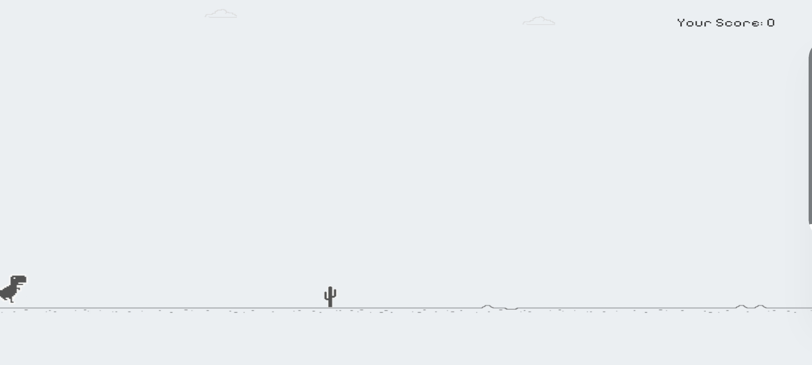
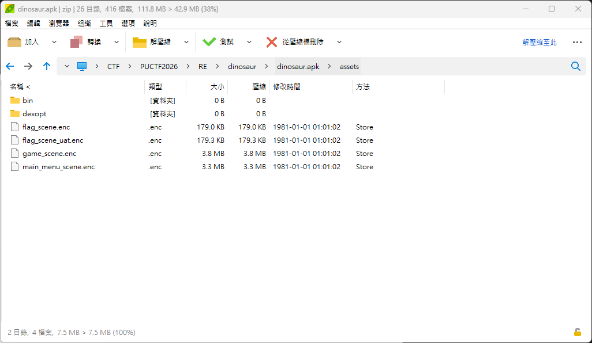
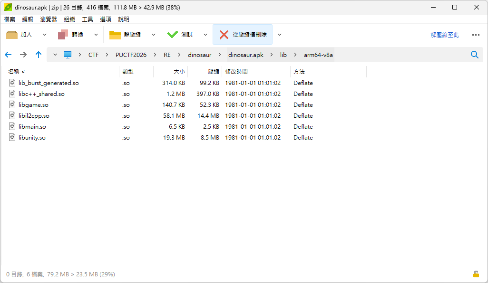
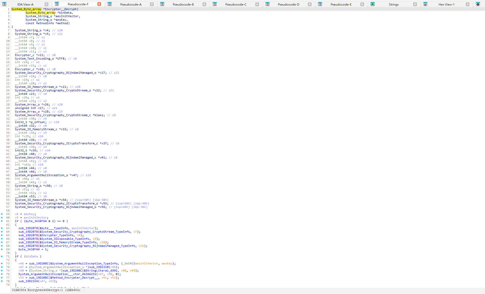
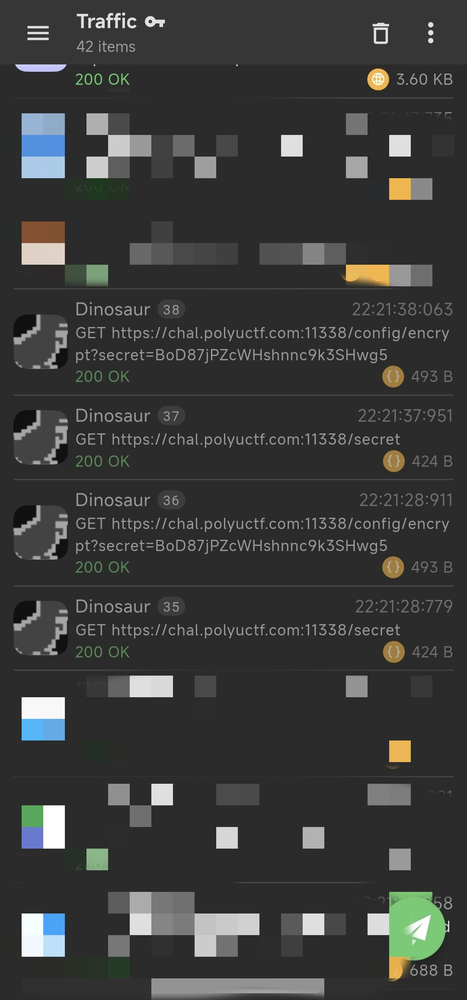
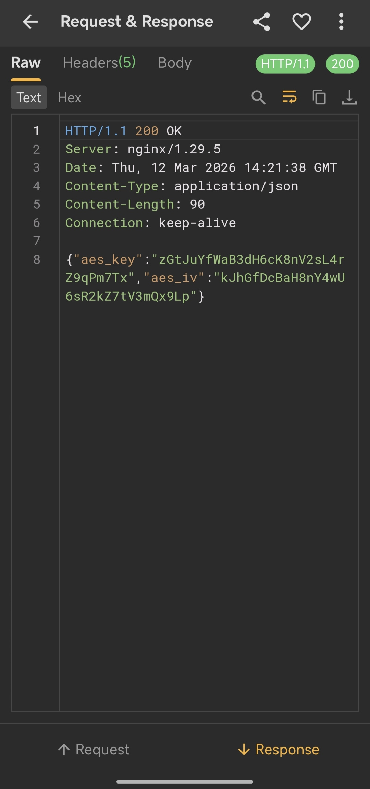
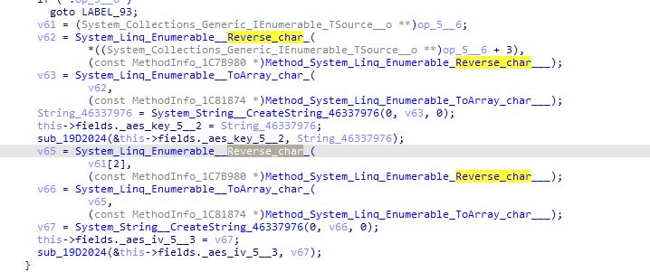
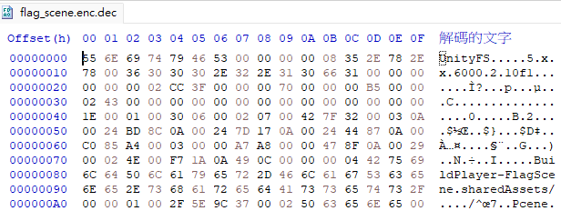
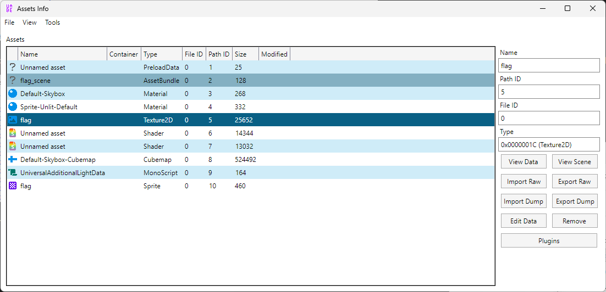
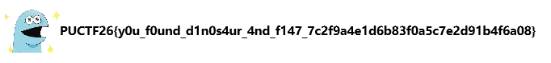

# Play with Dinosaur I

Can you reverse the application and give me the flag

Author: SalaryThief

Flag Format: `PUCTF26{[a-zA-Z0-9_]+_[a-fA-F0-9]{32}}`

---

First , we download the document dinosaur.zip and unzip it , we get dinosaur.apk

We can see this is a Dinosaur Game **.**

In the **assets** folder, we can see several encrypted files, including **flag_scene.enc**, **flag_scene_uat.enc**, **game_scene.enc**, and **main_menu_scene.enc**. The  **.enc** extension suggests that these files are encrypted, so we likely need to identify both the **encryption key** and the **encryption method** in order to decrypt them and recover the flag.



and we can see that the game includes **libil2cpp.so** in the lib folder, which indicates that it is a **Unity** game. Unity games are typically built using either **DLLs** or **IL2CPP**. In this case, since **libil2cpp.so** is present, we can use **Il2CppDumper** to reverse the IL2CPP binary.



After loading **libil2cpp.so** and **global-metadata.dat** into ​[Il2CppDumper](https://github.com/Perfare/Il2CppDumper), it generates several output files, including ​**dump.cs**​, ​**stringliteral.json**​, ​**script.json**​, and ​**il2cpp.h**.

then inspect **dump.cs** to analyze the game logic, where we find the following:

```cisco
// Namespace: 
public static class Encrypter // TypeDefIndex: 7661
{
	// Fields
	public const string AES_INIT_VECTOR = "J8nX3cP0vL5sQ2mT7kR9zH1dG6yU4wBa";
	public const string AES_KEY = "h4Qv9mZ2sT7kN8pL3xYc6D1wR5bG0uVa";
	private static string _AesInitVector; // 0x0
	private static string _AesKey; // 0x8
	private const int BlockSize = 256;
	private const int KeySize = 256;

	// Properties
	public static string AesInitVector { get; }
	public static string AesKey { get; }

	// Methods

	// RVA: 0x1AB478C Offset: 0x1AB078C VA: 0x1AB478C
	public static string get_AesInitVector() { }

	// RVA: 0x1AB484C Offset: 0x1AB084C VA: 0x1AB484C
	public static string get_AesKey() { }

	// RVA: 0x1AB4904 Offset: 0x1AB0904 VA: 0x1AB4904
	public static byte[] Decrypt(byte[] binData, string aesInitVector = "", string aesKey = "") { }

	// RVA: 0x1AB4F5C Offset: 0x1AB0F5C VA: 0x1AB4F5C
	private static void .cctor() { }
}


// Namespace: 
public class GameManager : MonoBehaviour // TypeDefIndex: 7663
{
	// Fields
	public GameObject cactus; // 0x20
	public Transform cactusSpawnPosition; // 0x28
	public float spawnTime; // 0x30
	public float minSpawnTime; // 0x34
	public float difficultyIncreaseRate; // 0x38
	private float timer; // 0x3C
	private float difficultyTimer; // 0x40
	public GameObject GameOverPanel; // 0x48
	public int score; // 0x50
	public int cactusCount; // 0x54
	public int maxCactusCount; // 0x58

	// Methods

	// RVA: 0x1AB4FFC Offset: 0x1AB0FFC VA: 0x1AB4FFC
	private void Awake() { }

	// RVA: 0x1AB5010 Offset: 0x1AB1010 VA: 0x1AB5010
	private void Start() { }

	// RVA: 0x1AB5040 Offset: 0x1AB1040 VA: 0x1AB5040
	private void Update() { }

	// RVA: 0x1AB46B4 Offset: 0x1AB06B4 VA: 0x1AB46B4
	public void GameOver() { }

	// RVA: 0x1AB51F0 Offset: 0x1AB11F0 VA: 0x1AB51F0
	public void RestartGame() { }

	// RVA: 0x1AB5258 Offset: 0x1AB1258 VA: 0x1AB5258
	public void .ctor() { }
}

```

To understand how the function are processed, we can inspect the function `Decrypt(byte[] binData, string aesInitVector = "", string aesKey = "")`​ at address **0x1AB4904** using **IDA**.

First, open **libil2cpp.so** in ​**IDA**​. To make the analysis easier, load the helper script produced by ​**Il2CppDumper**​. This can be done through ​**File → Script File**​, then selecting ​**ida\_with\_struct\_py3.py**​. After that, provide **script.json** and **il2cpp.h** when prompted. These files help IDA recover type information and improve readability during reverse engineering.



This is  a AES **Decrypt function , receive an encrypted byte array, decrypt it using the AES (Rijndael) algorithm, and then return a byte array containing the decryption result. So that we copy this to AI ,let AI to help use write a C# code :**

```Router
using System;
using System.IO;
using System.Text;Play with Dinosaur I
using System.Security.Cryptography;

class Program
{
    static byte[] Decrypt(byte[] binData, string aesInitVector, string aesKey)
    {
        if (binData == null)
            throw new ArgumentNullException(nameof(binData));

        byte[] keyBytes = Encoding.UTF8.GetBytes(aesKey);
        byte[] ivBytes = Encoding.UTF8.GetBytes(aesInitVector);

        using (var rij = new RijndaelManaged())
        {
            rij.Mode = CipherMode.CBC;
            rij.Padding = PaddingMode.PKCS7;
            rij.KeySize = keyBytes.Length * 8;
            rij.BlockSize = ivBytes.Length * 8;
            rij.Key = keyBytes;
            rij.IV = ivBytes;

            using (var decryptor = rij.CreateDecryptor())
            using (var ms = new MemoryStream(binData))
            using (var cs = new CryptoStream(ms, decryptor, CryptoStreamMode.Read))
            using (var outMs = new MemoryStream())
            {
                cs.CopyTo(outMs);
                return outMs.ToArray();
            }
        }
    }

    static void Main()
    {
        Console.Write("Enter key: ");
        string key = Console.ReadLine();

        Console.Write("Enter IV: ");
        string iv = Console.ReadLine();

        Console.Write("Enter encrypted file path: ");
        string inputPath = Console.ReadLine();

        string outputPath = inputPath + ".dec";

        byte[] enc = File.ReadAllBytes(inputPath);
        byte[] dec = Decrypt(enc, iv, key);
        File.WriteAllBytes(outputPath, dec);

        Console.WriteLine("Done: " + outputPath);
    }
}

```

Although we recovered a key and IV from the code, they could not successfully decrypt ​**flag\_scene.enc**. This indicates that they are likely not the actual values used in practice. The real key and IV may be obtained dynamically at runtime or hidden in another part of the application.

To investigate further, we captured the application’s network traffic by [Reqable](https://play.google.com/store/apps/details?id=com.reqable.android) and found the following:



After capturing the app’s network traffic, we found a request to the following endpoint:

​`GET /config/encrypt?secret=BoD87jPZcWHshnnc9k3SHwg5`

The response contained what appeared to be an AES key and IV:

- ​`key = "zGtJuYfWaB3dH6cK8nV2sL4rZ9qPm7Tx"`
- ​`iv = "kJhGfDcBaH8nY4wU6sR2kZ7tV3mQx9Lp"`

At first glance, these looked like the correct decryption parameters. However, they still failed to decrypt ​**flag\_scene.enc**​. This implied that the values returned by the server were not used directly, and that some additional transformation likely occurred before the call to `Decrypt`.

To verify this, we switched back to **IDA** and checked the **xrefs** to `Decrypt` in order to trace how the actual key and IV were derived.



We noticed that the game appears to use the **reversed key and IV** during decryption.Based on this observation, we tried reversing both values first:

- ​`key = "pL9xQm3Vt7Zk2Rs6Uw4Yn8HaBcDfGhJk"`
- ​`iv = "xT7mPq9Zr4Ls2Vn8Kc6Hd3BaWfYuJtGz"`

After reversing them and using the reversed values for decryption, we successfully obtained a file named `flag_scene.enc.dec`.



The decrypted file turned out to be a Unity resource, which we were able to inspect using UABEA.



Upon inspecting the asset in [UABEA](https://github.com/nesrak1/UABEA), we noticed a `Texture2D`​ entry, indicating that the file contained image data. By selecting the object and using **Plugins → Export Picture**, we were able to export the image and get the flag.



‍

‍
