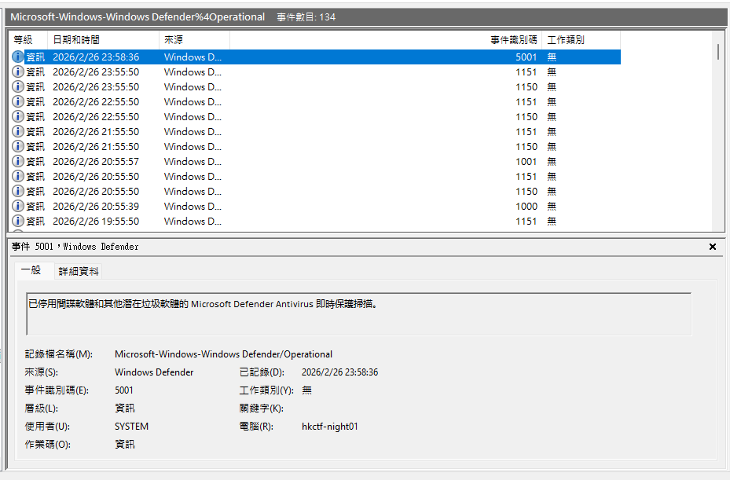
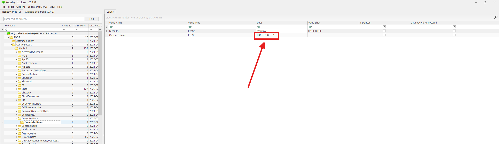
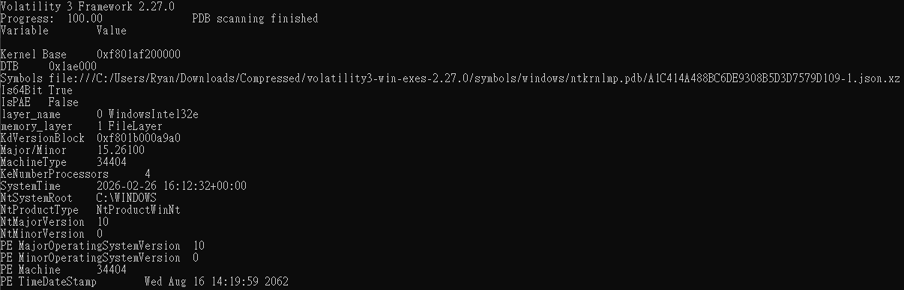

# Wheres the APT Attack mini 1 - AntiVirus Software Alert

You are a Senior Cybersecurity Analyst.  
Your Security Operations Center (SOC) has received an alert from your antivirus software indicating that protection was disabled on one of the endpoints in your organization.  
This victim machine has been isolated from the network.  
Your manager is requesting your assistance in analyzing an Incident Response (IR) package from the current investigation.  
The package contains a Windows memory image, Windows event logs, and Windows registry hive files.

Please find out when the antivirus software protection was disabled, and identify the corresponding Event ID.

Flag format: `PUCTF26{DisableTime_EventID_HostName_SystemTime}`

- Antivirus protection disabled exactly at (UTC): (e.g., 2026-01-01T01:01:01)
- Event ID: 4 digits (e.g., 1234)
- Hostname: (e.g., HOST-123)
- RAM dump file creation time (SystemTime) in UTC: (e.g., 2026-01-01T01:01:01)

Author: Nightsedge

Flag Format: `PUCTF26{[a-zA-Z0-9_:-]+_[a-zA-Z0-9_:-]+_[a-zA-Z0-9_:-]+_[a-zA-Z0-9_:-]+}`

---

First , we unzip 2026_nuttyshell_ctf_IR_package.zip and we can get:

```tree
└─IR_package
    │  hkctf-night01_memdump.mem
    │
    ├─evtx_logs
    │      Application.evtx
    │      HardwareEvents.evtx
    │      Internet Explorer.evtx
    │      Key Management Service.evtx
    │      Microsoft-Client-Licensing-Platform%4Admin.evtx
    │      Microsoft-Windows-AAD%4Operational.evtx
    │      Microsoft-Windows-AppID%4Operational.evtx
    │      Microsoft-Windows-Application-Experience%4Program-Compatibility-Assistant.evtx
    │      Microsoft-Windows-Application-Experience%4Program-Compatibility-Troubleshooter.evtx
    │      Microsoft-Windows-Application-Experience%4Program-Inventory.evtx
    │      Microsoft-Windows-Application-Experience%4Program-Telemetry.evtx
    │      Microsoft-Windows-Application-Experience%4Steps-Recorder.evtx
    │      Microsoft-Windows-AppLocker%4EXE and DLL.evtx
    │      Microsoft-Windows-AppLocker%4MSI and Script.evtx
    │      Microsoft-Windows-AppLocker%4Packaged app-Deployment.evtx
    │      Microsoft-Windows-AppLocker%4Packaged app-Execution.evtx
    │      Microsoft-Windows-AppModel-Runtime%4Admin.evtx
    │      Microsoft-Windows-AppReadiness%4Admin.evtx
    │      Microsoft-Windows-AppReadiness%4Operational.evtx
    │      Microsoft-Windows-AppXDeployment%4Operational.evtx
    │      Microsoft-Windows-AppXDeployment-Server%4Operational.evtx
    │      Microsoft-Windows-AppXDeploymentServer%4Operational.evtx
    │      Microsoft-Windows-AppXDeploymentServer%4Restricted.evtx
    │      Microsoft-Windows-AppxPackaging%4Operational.evtx
    │      Microsoft-Windows-Audio%4CaptureMonitor.evtx
    │      Microsoft-Windows-Audio%4Operational.evtx
    │      Microsoft-Windows-Audio%4PlaybackManager.evtx
    │      Microsoft-Windows-BackgroundTaskInfrastructure%4Operational.evtx
    │      Microsoft-Windows-Biometrics%4Operational.evtx
    │      Microsoft-Windows-Bits-Client%4Operational.evtx
    │      Microsoft-Windows-CloudFiles-Filter%4Operational.evtx
    │      Microsoft-Windows-CloudRestoreLauncher%4Operational.evtx
    │      Microsoft-Windows-CloudStore%4Initialization.evtx
    │      Microsoft-Windows-CloudStore%4Operational.evtx
    │      Microsoft-Windows-CodeIntegrity%4Operational.evtx
    │      Microsoft-Windows-Containers-BindFlt%4Operational.evtx
    │      Microsoft-Windows-Containers-Wcifs%4Operational.evtx
    │      Microsoft-Windows-Crypto-DPAPI%4BackUpKeySvc.evtx
    │      Microsoft-Windows-Crypto-DPAPI%4Operational.evtx
    │      Microsoft-Windows-Crypto-NCrypt%4CertInUse.evtx
    │      Microsoft-Windows-Crypto-NCrypt%4KeyMgmt.evtx
    │      Microsoft-Windows-Crypto-NCrypt%4Operational.evtx
    │      Microsoft-Windows-DeviceManagement-Enterprise-Diagnostics-Provider%4Admin.evtx
    │      Microsoft-Windows-DeviceManagement-Enterprise-Diagnostics-Provider%4Autopilot.evtx
    │      Microsoft-Windows-DeviceManagement-Enterprise-Diagnostics-Provider%4Enrollment.evtx
    │      Microsoft-Windows-DeviceManagement-Enterprise-Diagnostics-Provider%4Operational.evtx
    │      Microsoft-Windows-DeviceManagement-Enterprise-Diagnostics-Provider%4Sync.evtx
    │      Microsoft-Windows-DeviceSetupManager%4Admin.evtx
    │      Microsoft-Windows-DeviceSetupManager%4Operational.evtx
    │      Microsoft-Windows-Dhcp-Client%4Admin.evtx
    │      Microsoft-Windows-Dhcpv6-Client%4Admin.evtx
    │      Microsoft-Windows-Diagnosis-DPS%4Operational.evtx
    │      Microsoft-Windows-Diagnosis-PCW%4Operational.evtx
    │      Microsoft-Windows-Diagnosis-Scheduled%4Operational.evtx
    │      Microsoft-Windows-Diagnostics-Performance%4Operational.evtx
    │      Microsoft-Windows-FileHistory-Core%4WHC.evtx
    │      Microsoft-Windows-GroupPolicy%4Operational.evtx
    │      Microsoft-Windows-HelloForBusiness%4Operational.evtx
    │      Microsoft-Windows-Host-Network-Service-Admin.evtx
    │      Microsoft-Windows-Host-Network-Service-Operational.evtx
    │      Microsoft-Windows-HotspotAuth%4Operational.evtx
    │      Microsoft-Windows-Hyper-V-Hypervisor-Admin.evtx
    │      Microsoft-Windows-Hyper-V-Hypervisor-Operational.evtx
    │      Microsoft-Windows-Hyper-V-VmSwitch-Operational.evtx
    │      Microsoft-Windows-IKE%4Operational.evtx
    │      Microsoft-Windows-Kernel-Boot%4Operational.evtx
    │      Microsoft-Windows-Kernel-Cache%4Operational.evtx
    │      Microsoft-Windows-Kernel-Dump%4Operational.evtx
    │      Microsoft-Windows-Kernel-PnP%4Configuration.evtx
    │      Microsoft-Windows-Kernel-PnP%4Device Management.evtx
    │      Microsoft-Windows-Kernel-PnP%4Driver Watchdog.evtx
    │      Microsoft-Windows-Kernel-Power%4Thermal-Operational.evtx
    │      Microsoft-Windows-Kernel-ShimEngine%4Operational.evtx
    │      Microsoft-Windows-Kernel-StoreMgr%4Operational.evtx
    │      Microsoft-Windows-Kernel-WHEA%4Errors.evtx
    │      Microsoft-Windows-Kernel-WHEA%4Operational.evtx
    │      Microsoft-Windows-Known Folders API Service.evtx
    │      Microsoft-Windows-LanguagePackSetup%4Operational.evtx
    │      Microsoft-Windows-LiveId%4Operational.evtx
    │      Microsoft-Windows-MUI%4Admin.evtx
    │      Microsoft-Windows-MUI%4Operational.evtx
    │      Microsoft-Windows-NCSI%4Operational.evtx
    │      Microsoft-Windows-NetworkProfile%4Operational.evtx
    │      Microsoft-Windows-Ntfs%4Operational.evtx
    │      Microsoft-Windows-Ntfs%4WHC.evtx
    │      Microsoft-Windows-Partition%4Diagnostic.evtx
    │      Microsoft-Windows-PCI%4Operational.evtx
    │      Microsoft-Windows-Perflib%4Operational.evtx
    │      Microsoft-Windows-PowerShell%4Admin.evtx
    │      Microsoft-Windows-PowerShell%4Operational.evtx
    │      Microsoft-Windows-PrintService%4Admin.evtx
    │      Microsoft-Windows-Privacy-Auditing%4Operational.evtx
    │      Microsoft-Windows-Program-Compatibility-Assistant%4CompatAfterUpgrade.evtx
    │      Microsoft-Windows-Provisioning-Diagnostics-Provider%4Admin.evtx
    │      Microsoft-Windows-Provisioning-Diagnostics-Provider%4AutoPilot.evtx
    │      Microsoft-Windows-Provisioning-Diagnostics-Provider%4ManagementService.evtx
    │      Microsoft-Windows-PushNotification-Platform%4Admin.evtx
    │      Microsoft-Windows-PushNotification-Platform%4Operational.evtx
    │      Microsoft-Windows-ReadyBoost%4Operational.evtx
    │      Microsoft-Windows-Regsvr32%4Operational.evtx
    │      Microsoft-Windows-Resource-Exhaustion-Detector%4Operational.evtx
    │      Microsoft-Windows-Resource-Exhaustion-Resolver%4Operational.evtx
    │      Microsoft-Windows-RestartManager%4Operational.evtx
    │      Microsoft-Windows-Security-LessPrivilegedAppContainer%4Operational.evtx
    │      Microsoft-Windows-Security-Mitigations%4KernelMode.evtx
    │      Microsoft-Windows-Security-Mitigations%4UserMode.evtx
    │      Microsoft-Windows-Security-SPP-UX-Notifications%4ActionCenter.evtx
    │      Microsoft-Windows-Shell-ConnectedAccountState%4ActionCenter.evtx
    │      Microsoft-Windows-Shell-Core%4ActionCenter.evtx
    │      Microsoft-Windows-Shell-Core%4AppDefaults.evtx
    │      Microsoft-Windows-Shell-Core%4LogonTasksChannel.evtx
    │      Microsoft-Windows-Shell-Core%4Operational.evtx
    │      Microsoft-Windows-SmbClient%4Audit.evtx
    │      Microsoft-Windows-SmbClient%4Connectivity.evtx
    │      Microsoft-Windows-SMBClient%4Operational.evtx
    │      Microsoft-Windows-SmbClient%4Security.evtx
    │      Microsoft-Windows-SMBServer%4Audit.evtx
    │      Microsoft-Windows-SMBServer%4Connectivity.evtx
    │      Microsoft-Windows-SMBServer%4Operational.evtx
    │      Microsoft-Windows-SMBServer%4Security.evtx
    │      Microsoft-Windows-StateRepository%4Operational.evtx
    │      Microsoft-Windows-StateRepository%4Restricted.evtx
    │      Microsoft-Windows-Storage-Storport%4Health.evtx
    │      Microsoft-Windows-Storage-Storport%4Operational.evtx
    │      Microsoft-Windows-StorageManagement%4Operational.evtx
    │      Microsoft-Windows-StorageSpaces-Driver%4Diagnostic.evtx
    │      Microsoft-Windows-StorageSpaces-Driver%4Operational.evtx
    │      Microsoft-Windows-StorageSpaces-ManagementAgent%4WHC.evtx
    │      Microsoft-Windows-StorageVolume%4Diagnostic.evtx
    │      Microsoft-Windows-StorageVolume%4Operational.evtx
    │      Microsoft-Windows-Store%4Operational.evtx
    │      Microsoft-Windows-Storsvc%4Diagnostic.evtx
    │      Microsoft-Windows-TaskScheduler%4Maintenance.evtx
    │      Microsoft-Windows-TerminalServices-LocalSessionManager%4Admin.evtx
    │      Microsoft-Windows-TerminalServices-LocalSessionManager%4Operational.evtx
    │      Microsoft-Windows-Time-Service%4Operational.evtx
    │      Microsoft-Windows-TWinUI%4Operational.evtx
    │      Microsoft-Windows-TZSync%4Operational.evtx
    │      Microsoft-Windows-UniversalTelemetryClient%4Operational.evtx
    │      Microsoft-Windows-User Device Registration%4Admin.evtx
    │      Microsoft-Windows-User Profile Service%4Operational.evtx
    │      Microsoft-Windows-UserPnp%4ActionCenter.evtx
    │      Microsoft-Windows-UserPnp%4DeviceInstall.evtx
    │      Microsoft-Windows-VolumeSnapshot-Driver%4Operational.evtx
    │      Microsoft-Windows-VPN%4Operational.evtx
    │      Microsoft-Windows-Wcmsvc%4Operational.evtx
    │      Microsoft-Windows-WebAuthN%4Operational.evtx
    │      Microsoft-Windows-WER-PayloadHealth%4Operational.evtx
    │      Microsoft-Windows-WFP%4Operational.evtx
    │      Microsoft-Windows-Windows Defender%4Operational.evtx
    │      Microsoft-Windows-Windows Defender%4WHC.evtx
    │      Microsoft-Windows-Windows Firewall With Advanced Security%4ConnectionSecurity.evtx
    │      Microsoft-Windows-Windows Firewall With Advanced Security%4Firewall.evtx
    │      Microsoft-Windows-Windows Firewall With Advanced Security%4FirewallDiagnostics.evtx
    │      Microsoft-Windows-WindowsBackup%4ActionCenter.evtx
    │      Microsoft-Windows-WindowsSystemAssessmentTool%4Operational.evtx
    │      Microsoft-Windows-WindowsUpdateClient%4Operational.evtx
    │      Microsoft-Windows-WinINet-Config%4ProxyConfigChanged.evtx
    │      Microsoft-Windows-Winlogon%4Operational.evtx
    │      Microsoft-Windows-WinRM%4Operational.evtx
    │      Microsoft-Windows-WMI-Activity%4Operational.evtx
    │      Microsoft-Windows-WorkFolders%4WHC.evtx
    │      OAlerts.evtx
    │      Parameters.evtx
    │      Plugin-Passkey-Providers%4Operational.evtx
    │      Security.evtx
    │      Setup.evtx
    │      State.evtx
    │      Synced-Passkey-Provider%4Operatonal.evtx
    │      System.evtx
    │      Visual Studio.evtx
    │      Windows PowerShell.evtx
    │
    └─Registry_dump
        │  default
        │  SAM
        │  SECURITY
        │  software
        │  system
        │  userdiff
        │
        └─Users
            ├─Default
            │      NTUSER.DAT
            │
            └─User
                └─Crypto
```

Our objective was to recover the following artifacts:

- **Antivirus protection disabled time (UTC)**
- **Event ID**
- **Hostname**
- **RAM dump creation time (SystemTime) in UTC**

### Antivirus protection disabled time & **Event ID:**

To determine when antivirus protection was disabled, we examined the Windows Defender operational event log.

1. Open ​**Event Viewer**.
2. Right-click **Event Viewer** and select ​**Open Saved Log**.
3. Load the file `Microsoft-Windows-Windows Defender%4Operational.evtx`.

   
4. Look for the relevant **Windows Defender** event indicating that protection was disabled.
5. We identified **Event ID 5001** with the timestamp **2026/02/26 23:58:36**.
6. After converting the timestamp to UTC, the exact time is ​**2026-02-26T15:58:36**.

### **Hostname:**

To determine the system hostname, we examined the `SYSTEM`​ registry hive using ​[Registry Explorer](https://download.ericzimmermanstools.com/net9/RegistryExplorer.zip).  
The hostname can be found under the following key:

​`ControlSet001\Control\ComputerName\ComputerName`

From this entry, we confirmed that the hostname was ​**HKCTF-NIGHT01**.



### **RAM dump creation time (SystemTime) in UTC :**

To identify the RAM dump creation time, we used [Volatility3](https://github.com/volatilityfoundation/volatility3/releases) to inspect the memory image:

​`vol.exe -f D:\CTF\PUCTF2026\Forensics\2026_nuttyshell_ctf_IR_package\IR_package\hkctf-night01_memdump.mem windows.info`

The output showed:



SystemTime      2026-02-26 16:12:32+00:00

Therefore, the RAM dump creation time in UTC was **2026-02-26T16:12:32**.

With all required artifacts recovered, we can now construct the final flag: `PUCTF26{2026-02-26T15:58:36_5001_HKCTF-NIGHT01_2026-02-26T16:12:32}`

‍
